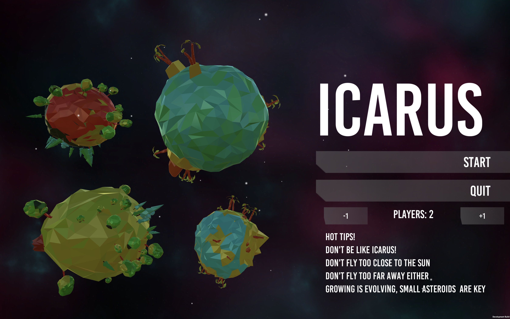
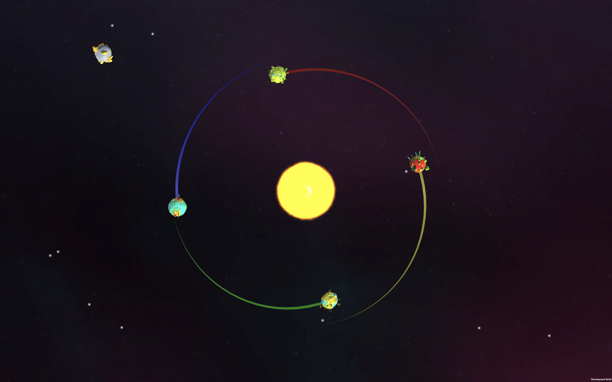

# Icarus!

A game created and hacked together during 18 hours @ [King Game Jam](http://kinggamejam.king.com) by Oskar Carlbaum, Johan Darnald, Loïc Benet and Michael Novén. Local multiplayer for 2-4 players that can either be played with keyboard or gamepads - we prefer gamepads.

Demo can be found [here](http://novalain.github.io/icarus)!

  
  

### Instructions
The goal is to stay away from the sun and be the last survivor - be aware of gravity that drags you towards the sun. You feel very well when you eat asterioids and evolve your planet when you
eat them! 

### Controls
##### Gamepad controls:
Move player with left thumbstick

##### Keyboard Controls: 
Player 1: WASD, Player 2: Arrow keys, Player 3: TFGH, Player 4: IJKL
